# Blockchain

## Set up Accounts
As seen below, the first step was to create two accounts at node_1 and node_2. Before I did anything, I activated the ethereum environment. Then, I ran ./geth account new --datadir node_1 to create node_1 and ./geth account new --datadir node_2 to create node_2. I copied the public addresses of both accounts to a separate local file for future use.

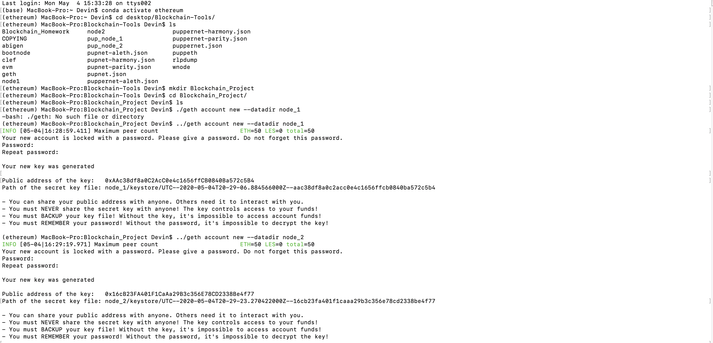

## Set up Genesis Block
The next step was to initiate the genesis block. I navigated into the Blockchain_Project directory and ran ../puppeth. I followed the prompts to configure a new genesis, selected proof-of-authority consensus, chose a chainID to use later, and then I pre-funded the accounts created in the step above.

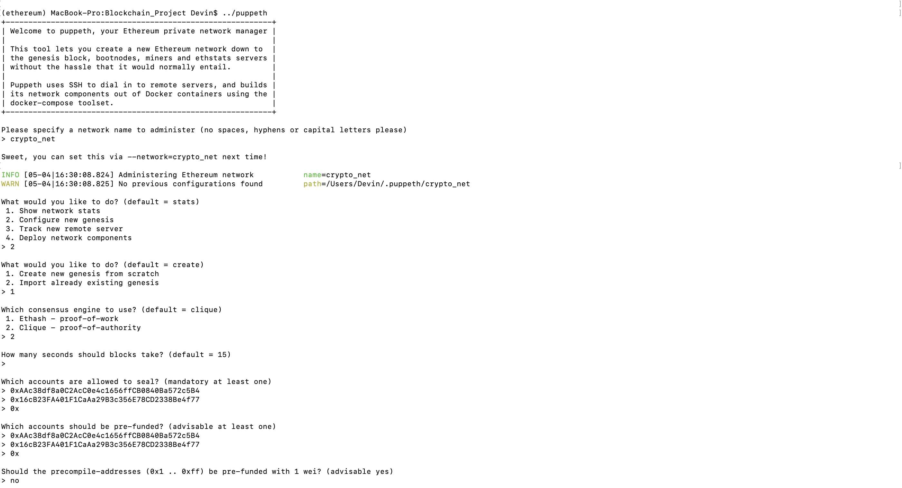

I then exported my genesis configuration and saved its contents as crypto_net.json in the current working directory. 

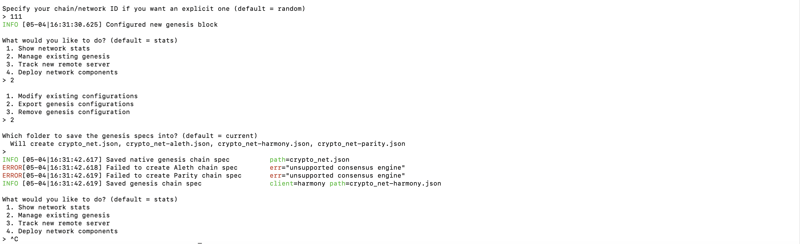

## Initiate and run nodes
Next, I opened two new nodes in order to initiate and run the nodes sepaerately. 

Node 1:
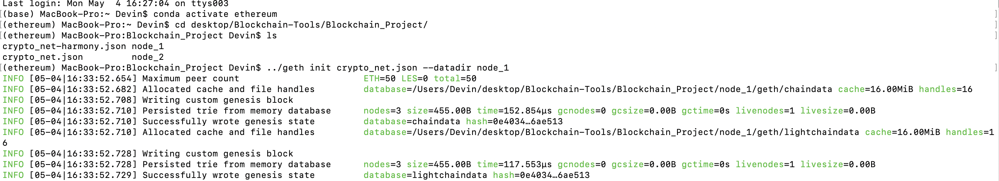

Node 2:
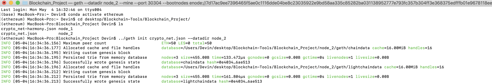

Then I began the mining of node 1 by running the command ../geth --datadir node_1 --unlock "{node_1 key}" --mine --rpc --allow-insecure-unlock. I made sure to copy the enode address that was provided after the mining began into my local text file so I could use it in the next step.

Node 1:
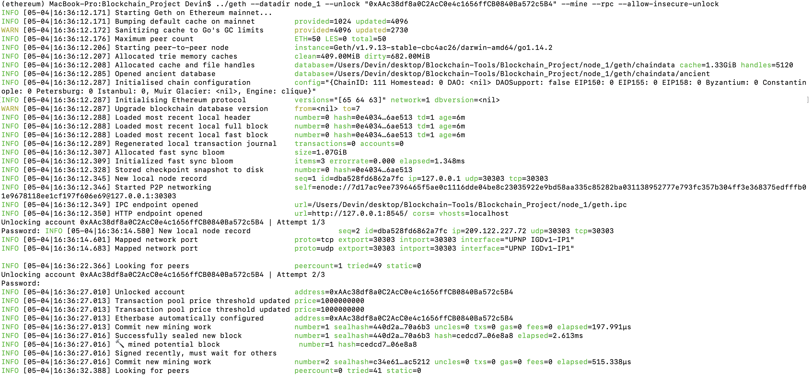
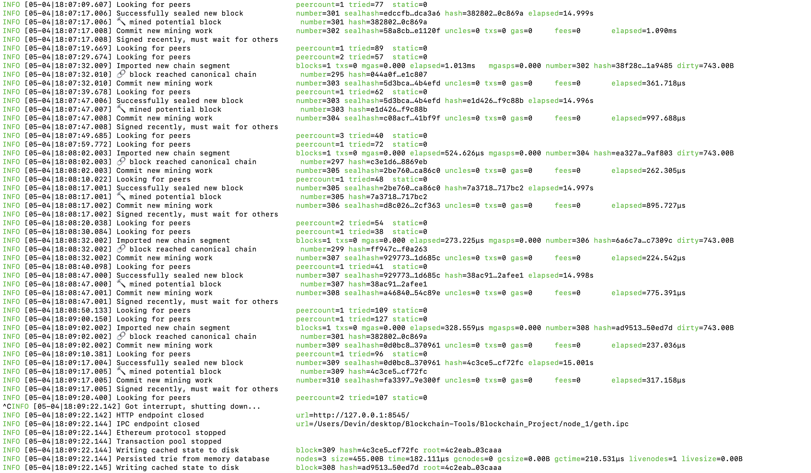

Node 2 was mined with the following command: ../geth --datadir node_2 --mine --port 30304 --bootnodes "{enode of node_2}" --unlock "{node_2 key}" --allow-insecure-unlock.

Node 2:
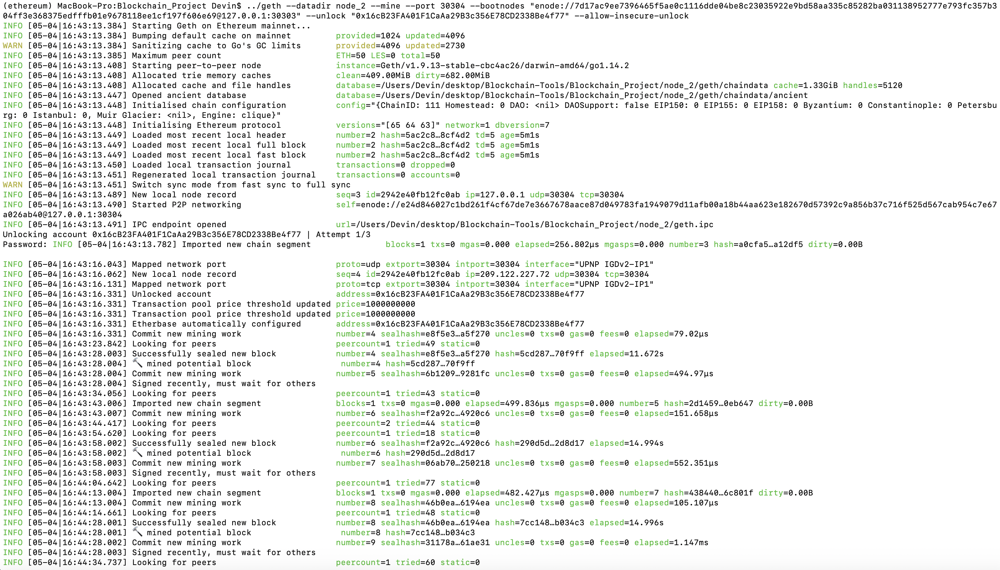
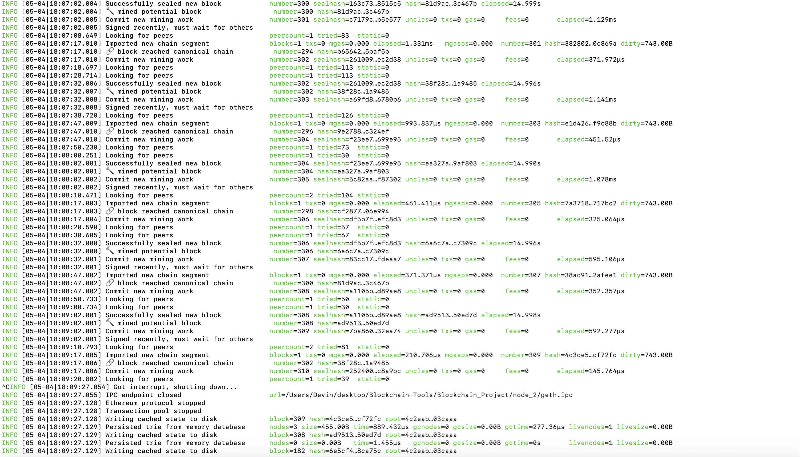

## Set up network
Once the nodes were successfully mining, I opened myCrypto and set up a custom network using the chainID I chose when initiating the genesis block. 

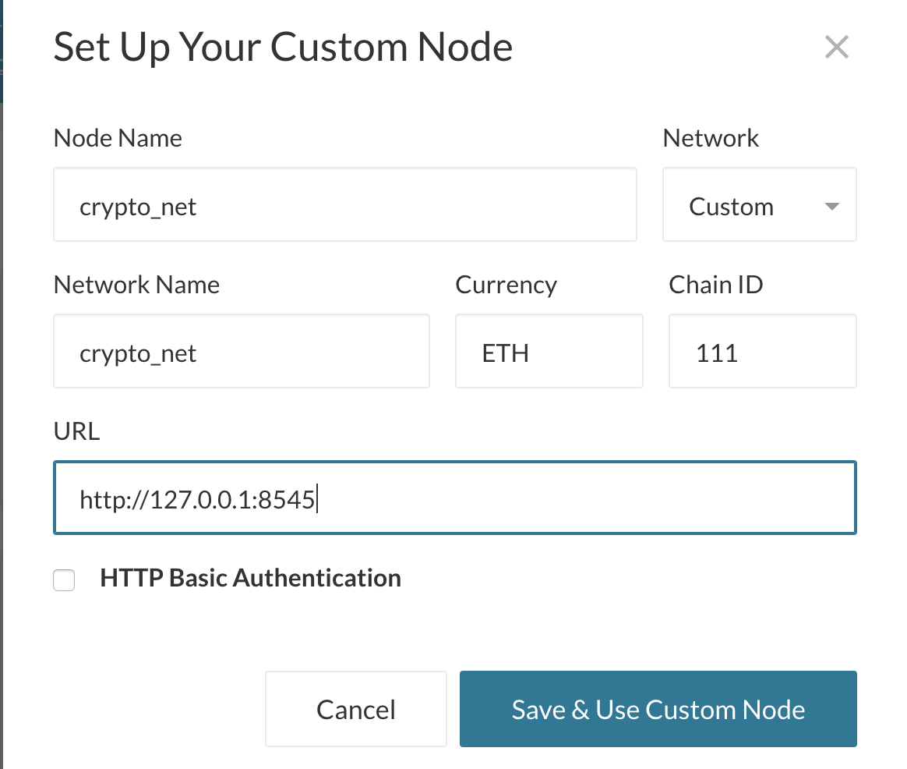

I then logged into node_1's account using the keystore file generated when I created the account.

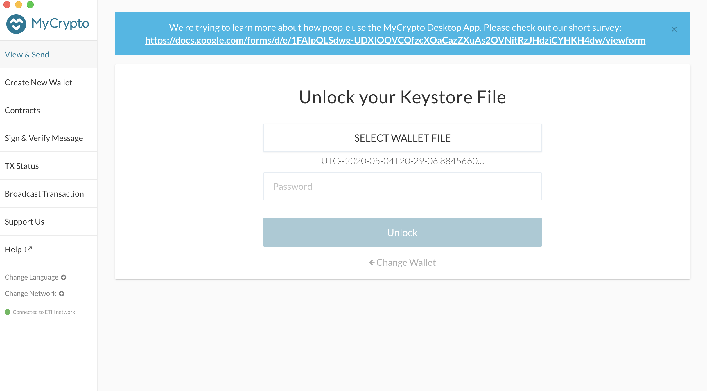

I verified that the account balance had increased from 0.

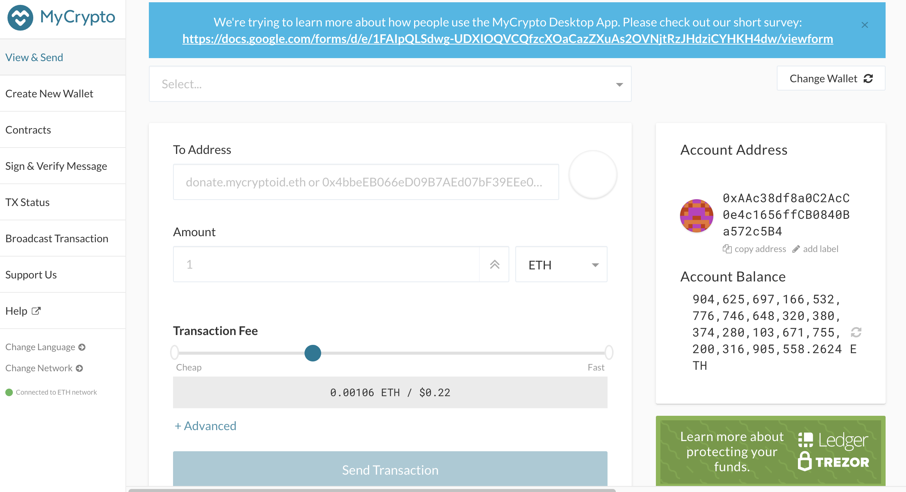

## Transaction
I sent a transaction of 1,000 ETH from the node_1 account to the node_2 account.

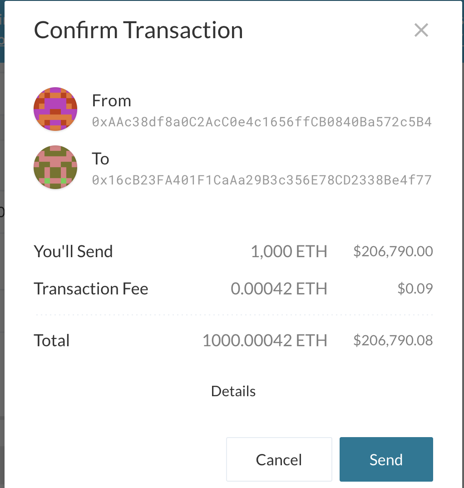

Finally, I viewed the transaction confirmation, which includes the transaction hash, fee, etc.

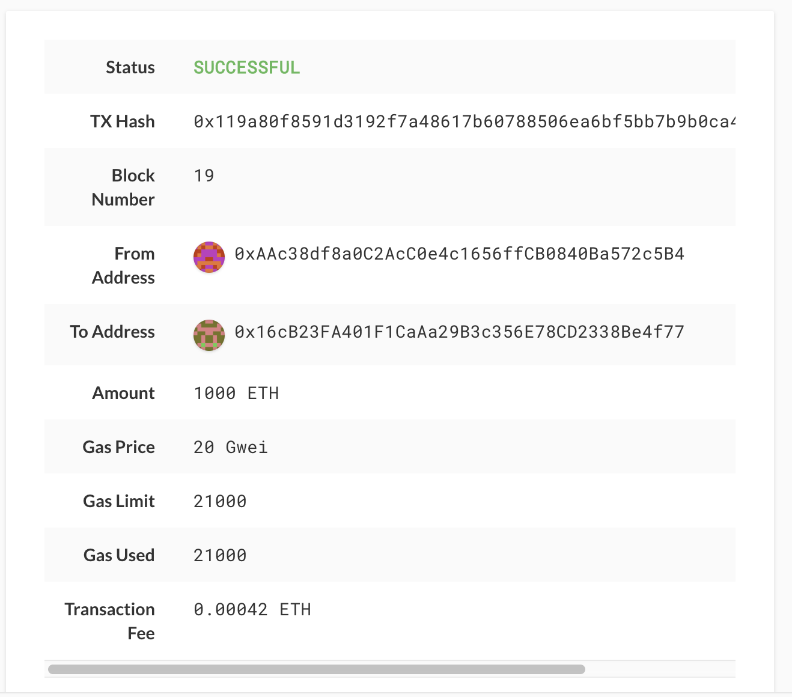

